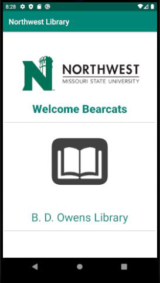

# android-library-app
Developing a library application which is used for searching and renting books using mobile application.

<h1>App Name:Northwest Library</h1>
<h2>App Logo<h2>
  
<h2>Team Members:</h2>
 <li> Anil Bomma</li>
 <li> Deepthi Tejaswani Chokka</li>
 <li> Rethimareddy Polam</li>
 <li> Mahender Reddy Surkanti</li>

<h2> Introduction to our Project:</h2>

  Our B. D. Owens Library is maintaining website for the book tracking. To know where a specific book is located in library, we need to go to library and use only library desktops. By our project we will create an android application in which we will keep track of all the books in the library. Admin will add the book name, details and the location where it is kept and the users will search the book by book name or description and can see in which place the book is located. The users/Student can also view the books they already borrowed and the due dates of them are also shown.
  

  
  <h2>Specifications/Support Version:</h2>

We are using android API version of pixel 3a XL API 28. The size of the layout is 1080*2160 with a density of 400. 
The complete details of the device we have used in our project is:
Device Name: Pixel 3a XL API 28
Android API: 9.0 API 28
Size: 1080*2160 

Database: Firebase
    
  <h2>Installation Steps</h2>
  

  
  <h2>Requirements:</h2>
  

  <ul>
Mobile with the Android operating System.
We need the above API properties to run the app and to have good user interface.
Minimum 1 GB RAM.
Minimum 8 GB internal storage
To run this app we need internet.
</ul>

<h2>Sources used for our Project:</h2>

  <li> https://stackoverflow.com/questions/15748558/android-developer-documentation-download</li>
  <li> https://www.youtube.com/watch?v=tLVz5wmNyrw</li>

<h2>Test Credentials:</h2>

<li>
 Username for Admin: s537157@nwmissouri.edu
 password:123456
 </li>
 <li>
 Username for Department Admin: s537240@nwmissouri.edu
 password:123456
 </li>

<h2>Layouts of our project:<h2>
   <ul>
 <h3>Splash Screeen:</h3>

  

The splash screen will be the launch page. This screen acts as a splash screen. A splash screen is usually used when a game or program is launching. In this app, a splash screen is used to launch the app and show it like a welcome screen.   
  

     
  </ul>
 <ul>
   <h3>Login Screen:</h3>
  

The login page will be used for the app in which the user will enter their credentials like username and password of if they are new user they have button called register, by clicking it they will redirect to registration page where the details of the user/students are entered. 
  

  </ul>
  <ul>
   <h3>Registration Screen :</h3>
  

If the student/user is new to the application they need to register themselves into this by giving the basic details for them like name, #919 number and contact details. We will also add form validations for the inputs given.
  

  </ul>
  <ul>
   <h3>Home Screen:</h3>
  

The user will enter into home page of the application in which there are 2 buttons available one of them is book search and the other is reserve rooms.
  

  </ul>
  <ul>
   <h3>Book search : </h3>
  

This screen will show up search option will be displayed on top of screen and the sections under it. Once the book needed is selected the section and the row in which the book is present is highlighted. 
  

  </ul>
  <ul>
   <h3>Reserve Room:</h3>
  

There are 2 blocks one is currently available rooms and second one is reserved rooms. In the currently available room block all the available room details are shown as a button, on clicking it we will get to a page named book a study room.
  

  </ul>
  <ul>
   <h3>Book a Study Room:</h3>
  

In this page the user/student will provide the details of them and select the time the room is required for. 
By clicking this option the app will redirect to a page in which we are asked to select from individual room or group discursion rooms available and the time they need. The user can register the rooms only on the day they need. Once the user/student selects there preference they can see all the rooms available at selected time slot.
  

  </ul>
  <ul>
   <h3>Profile:</h3>
  

This page will show the details of the user/student which they have entered at the time of registration.
  

  </ul>
  <ul>
   <h3>Adding books:</h3>
  

This privilege is only given to admins. Every time a new book imported, the book details are entered by the admin. This page will contain all the edit text to add details of the book. The details will be stored in database.
  

  </ul>
  <ul>
   <h3>Statistics for Admin:</h3>
  

This privilege is given for admins only. In this page the admin will get to known the list of available rooms, reserved rooms, books lent, books available and etc.,
He will also have some privileges to view books available and other stuff like removing books, editing the details of books. 
  

  </ul>
  </li>

 

